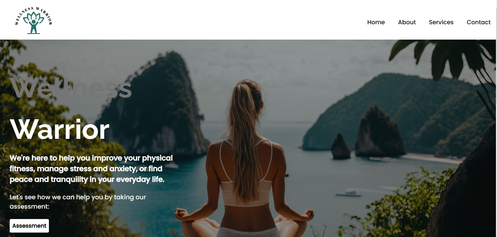

## Wellness Warrior🧘‍♀️

# Table of contents
- [Overview](#overview)
  - [Objective](#objective)
  - [Screenshot](#screenshot)
  - [Links](#links)
- [Our process](#our-process)
  - [Technologies Used](#technologies-used)
  - [What we learned](#what-we-learned)
  - [Usage](#usage)
  - [Future Development Ideas](#future-development-ideas)
  - [Author](#author)
  - [Credits](#credits)

## Overview

Wellness Warrior is designed to help users cope with stress, anxiety, depression, and other mental health conditions. It takes you to an assessment page where you have to fill out a questionnaire session,based on the input it calculates the severity of the well-being and redirects to the required services.Services include expert advice,counselling,journals ,advices on proper diet ,importance of physical activities. Overall, Wellness Warrior can be a powerful tool for individuals looking to manage their mental health and improve their overall well-being. It can provide a range of resources and support to help users navigate the challenges of living with a mental health condition.

### Objective

Our objective was to work together as a team to develop this web application, starting from the idea phase and continuing through to deployment. Our goal was to ensure that we had a minimum viable product that was ready for release.

### Screenshot

### Links

- Live Site URL: https://cosmic-gaufre-4af241.netlify.app/
- GitHub Url: https://github.com/Aymussa/Wellness-Warrior.git

## Our process

We were required to find new technology and incorporate it in our ReactJS app. Numerous efforts were made with various concepts before we settled on Mental wellness and the importance of maintaining a healthy wellbeing.

### Technologies Used

+ ReactJS
+ Tailwind
+ CSS
+ HTML5
+ API
+ NodeJs
+ Bootstrap
+ Google Slides
+ Figma (Wireframing)
+ Netlify (Deployment)
+ Git 
+ GitHub

### What we learned

For the most part the newest part of building this page was learning to work in a team, take on smaller pieces of the whole, the process of give and take, as well as learning new aspects of GitHub - project side, the board, switching branches, pushing to main and accepting other team members pull requests.

We've also learned the importance of collaborative learning and sharing of ideas to foster creativity. Through this process, we have challenged ourselves to learn new technology Tailwind and implement it into React app.We have also used an API to retrieve data.Deploying the application in Netlify was another skill we have mastered.

### Usage

Wellness Warrior will take you to a user-friendly app where  you can take control of your well-being. We created a quick 10 question assessment with lifestyle support to help users improve their overall well-being and feel their best. 
Answer those 10 questions and it will get you advice according to the severity.It navigates you through certain journals on how to maintain the wellbeing.

### Future Development Ideas

 As we continue to develop and improve Wellness Warrior, here are some potential features and improvements we plan to implement:

+ Integrate more features for personalized well-being plans based on the user's assessment results
+ Incorporate machine learning algorithms to provide more accurate assessment results and personalized recommendations
+ Partner with mental health professionals and organizations to offer additional resources and support for users
+ Implement a community forum or support group feature to connect users with others who are also dealing with mental health conditions
+ Add more educational resources on mental health and wellbeing, such as podcasts, videos, blogs and articles.
+ Allow users to create an account so that they can login and access whenever required

### Author

+ Jessie Kinganga
  - GitHub - [KingJessie](https://github.com/KingJessie)

+ Ahmed Mussa
  - GitHub - [AhmedMussa](https://github.com/Aymussa)

+ Abby Egbo
  - GitHub - [AbbyEgbo](https://github.com/AbbyIT)

+ Laly Firoze
  - GitHub - [LalyFiroze](https://github.com/LalyF)

### Credits

